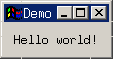

This is my first post on **readonly** — a tech blog powered by [Hugo](https://gohugo.io/) and deployed to my personal VPS. Let's make sure everything renders correctly.

## Writing Go: Hello World

Every journey starts with a hello world. Here's one in Go:

```go
package main

import "fmt"

func main() {
    fmt.Println("Hello from readonly.chyxxxxx.cc!")
}
```

Run it with:

```bash
go run main.go
```

## Why I Chose Hugo

There are a few reasons I picked Hugo for this blog:

- **Speed** — Hugo builds sites in milliseconds, even with hundreds of posts.
- **Single binary** — No Node.js, no npm, no dependency hell. Just one executable.
- **Markdown native** — I write in Markdown every day, so this feels natural.
- **Go templates** — A chance to get more comfortable with Go's ecosystem.

## Framework Comparison

Here's a quick comparison of the tools I evaluated before starting this blog:

| Framework | Language | Build Speed | JS Shipped | Learning Curve |
| --------- | -------- | ----------- | ---------- | -------------- |
| Hugo      | Go       | ~50ms       | Zero       | Medium         |
| Astro     | JS/TS    | ~1-3s       | Minimal    | Low            |
| Next.js   | JS/TS    | ~5-15s      | Heavy      | Medium-High    |
| Jekyll    | Ruby     | ~5-30s      | Zero       | Low            |
| 11ty      | JS       | ~1-2s       | Zero       | Low            |

Hugo wins on raw speed, but Astro is excellent too — I used it for my portfolio site.

## Adding Images

Drop your images into `static/images/` and reference them in markdown like this:

```markdown

```


Which renders as:
This is my first post on **readonly** — a tech blog powered by [Hugo](https://gohugo.io/) and deployed to my personal VPS. Let's make sure everything renders correctly.

## Writing Go: Hello World

Every journey starts with a hello world. Here's one in Go:

```go
package main

import "fmt"

func main() {
    fmt.Println("Hello from readonly.chyxxxxx.cc!")
}
```

Run it with:

```bash
go run main.go
```

## Why I Chose Hugo

There are a few reasons I picked Hugo for this blog:

- **Speed** — Hugo builds sites in milliseconds, even with hundreds of posts.
- **Single binary** — No Node.js, no npm, no dependency hell. Just one executable.
- **Markdown native** — I write in Markdown every day, so this feels natural.
- **Go templates** — A chance to get more comfortable with Go's ecosystem.

## Framework Comparison

Here's a quick comparison of the tools I evaluated before starting this blog:

| Framework | Language | Build Speed | JS Shipped | Learning Curve |
| --------- | -------- | ----------- | ---------- | -------------- |
| Hugo      | Go       | ~50ms       | Zero       | Medium         |
| Astro     | JS/TS    | ~1-3s       | Minimal    | Low            |
| Next.js   | JS/TS    | ~5-15s      | Heavy      | Medium-High    |
| Jekyll    | Ruby     | ~5-30s      | Zero       | Low            |
| 11ty      | JS       | ~1-2s       | Zero       | Low            |

Hugo wins on raw speed, but Astro is excellent too — I used it for my portfolio site.

## Adding Images

Drop your images into `static/images/` and referenc


> **Tip:** Organize images by post slug under `static/images/posts/<slug>/` to keep things tidy as your blog grows.

## Code Highlighting in Action

Hugo uses [Chroma](https://github.com/alecthomas/chroma) for syntax highlighting at build time — no client-side JavaScript needed. Here are a few more examples.

### Python

```python
def fibonacci(n: int) -> list[int]:
    fib = [0, 1]
    for i in range(2, n):
        fib.append(fib[i - 1] + fib[i - 2])
    return fib[:n]

print(fibonacci(10))
# [0, 1, 1, 2, 3, 5, 8, 13, 21, 34]
```

### YAML (Hugo config example)

```yaml
baseURL: "https://readonly.chyxxxxx.cc/"
locale: "en-us"
title: "readonly"
theme: "PaperMod"

params:
  defaultTheme: auto
  ShowCodeCopyButtons: true
  ShowReadingTime: true
```

### SQL

```sql
SELECT
    p.title,
    p.date,
    COUNT(t.name) AS tag_count
FROM posts p
LEFT JOIN post_tags pt ON p.id = pt.post_id
LEFT JOIN tags t ON pt.tag_id = t.id
GROUP BY p.id
ORDER BY p.date DESC
LIMIT 10;
```

## What's Next

Here's my rough roadmap for upcoming posts:

1. **Setting up CI/CD** — GitHub Actions + rsync to deploy this blog automatically.
2. **Building a CLI tool in Go** — A deep dive into `cobra` and `viper`.
3. **My Arch Linux setup** — mise, neovim, and the tools I use daily.
4. **Hugo custom shortcodes** — Building reusable components for tech writing.

## Wrapping Up

If you're reading this, the blog is live and everything works. Time to write some real content.

The source code for this blog lives on [GitHub](https://github.com/<you>/readonly). Feel free to poke around.

---

_Thanks for reading. If you spot any issues, open an issue on the repo._
